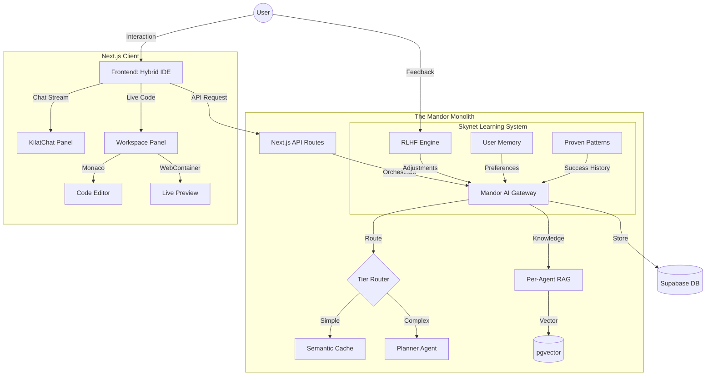

# KilatOS

<p align="center">
  <strong>⚡ AI-Powered Code Generation OS</strong>
</p>

<p align="center">
  Build complete web applications in seconds with conversational AI
</p>

---

## 🚀 Features

## 📊 System Topology



---

## 🚀 Key Features

### 🧠 Multi-Agent AI System
- **12 Specialized Agents**: 
  - `Planner` (Architect), `Coder` (Implementation), `Reviewer` (QA)
  - `Designer` (UI/UX), `Guide` (Docs), `Question` (Tutor)
- **Intelligent Routing**: Automatic model selection (Gemini, OpenAI, Groq) based on complexity.
- **Self-Healing**: Agents detect errors in generated code and auto-correct them.

### ⚡ Skynet Learning System (Self-Improving)
The system gets smarter with every interaction:
1.  **RLHF (Reinforcement Learning)**: Analyzes user feedback (👍/👎) to adjust prompt strategies.
2.  **Persistent Cache**: 72-hour Supabase-backed cache to survive Vercel cold starts.
3.  **Proven Patterns**: Automatically promotes successful code patterns to best practices.
4.  **User Memory**: Remembers your coding style and preferences across sessions.

### 🎨 KilatOS Design System
A premium, dark-mode-first aesthetic:
- **Palette**: Royal Purple (`#8B5CF6`) & Deep Obsidian (`#0A0A0B`)
- **Typography**: Plus Jakarta Sans (Headers) + JetBrains Mono (Code)
- **Effects**: Glassmorphism, Neon Glows, and smooth micro-interactions

### 💻 Hybrid IDE Experience
- **Monaco Editor**: Full VS Code experience in the browser.
- **WebContainer**: Runs Node.js natively in Chrome (no backend required for preview).
- **Live Preview**: See changes instantly as code generates.

---

## 🛠 Tech Stack

| Category | Technology |
|----------|------------|
| Frontend | Next.js 14, React 18, TypeScript, TailwindCSS |
| Backend | Next.js API Routes, Server Actions |
| Database | Supabase (PostgreSQL) |
| Auth | NextAuth.js + Supabase Auth |
| AI | Groq, OpenAI, Gemini, Pollinations API |
| Editor | Monaco Editor |
| Preview | WebContainer API |
| Embeddings | Xenova Transformers (384-dim) |

---

## 📦 Installation

```bash
# Clone the repository
git clone https://github.com/matiloanjing/KilatOS.git
cd KilatOS

# Install dependencies
npm install

# Set up environment variables
cp .env.example .env.local
# Edit .env.local with your API keys

# Run development server
npm run dev
```

Open [http://localhost:3000](http://localhost:3000) in your browser.

---

## ⚙️ Environment Variables

Create `.env.local` with the following:

```env
# Supabase
NEXT_PUBLIC_SUPABASE_URL=your_supabase_url
NEXT_PUBLIC_SUPABASE_ANON_KEY=your_anon_key
SUPABASE_SERVICE_ROLE_KEY=your_service_role_key

# AI Models (at least one required)
GROQ_API_KEY=your_groq_api_key
OPENAI_API_KEY=your_openai_api_key
GOOGLE_AI_API_KEY=your_gemini_api_key

# Optional
NEXTAUTH_SECRET=your_nextauth_secret
NEXTAUTH_URL=http://localhost:3000
```

---

## 📁 Project Structure

```
KilatOS/
├── app/                    # Next.js App Router
│   ├── api/                # API Routes (Cron, KilatCode, Auth)
│   ├── kilatcode/          # IDE Interface (Main App)
│   ├── chat/               # Standalone Chat Interface
│   └── admin/              # Admin Dashboard
├── components/             # React Components
│   ├── ui/                 # Design System (Radix UI + Tailwind)
│   ├── workspace/          # IDE Panels (Explorer, Terminal)
│   ├── MonacoEditor/       # Code Editor Wrapper
│   └── WebContainer/       # Live Preview Runtime
├── lib/                    # Core Business Logic
│   ├── agents/             # 12 AI Agents (Planner, Coder, etc.)
│   ├── cache/              # Caching Layer (Persistent + InMemory)
│   ├── learning/           # Skynet (RLHF, Self-Improve)
│   ├── memory/             # User & Session Context
│   ├── orchestrator/       # Mandor AI Gateway
│   ├── rag/                # RAG & Knowledge Base
│   └── auth/               # Supabase Auth Helpers
├── hooks/                  # Custom React Hooks
└── public/                 # Static Assets
```

---

## 🎯 Usage

### Generate a Web App
1. Open KilatOS at `/kilatcode`
2. Describe your app: "Create a Spotify clone with dark theme"
3. Watch AI plan and generate your app
4. Preview the running app in-browser
5. Download or deploy to Vercel

### Modes
- **Planning Mode**: Best for complex apps (e-commerce, dashboards)
- **Fast Mode**: Quick for simple components (buttons, forms)

---

## 📄 License

MIT License - KilatCode Studio 2026

---

## 🔗 Links

- **Website**: [kilatos.com](https://kilatos.com)
- **Discord**: [discord.gg/kilatos](https://discord.gg/kilatos)

---

<p align="center">
  <strong>Built with ❤️ by KilatCode Studio</strong>
</p>
